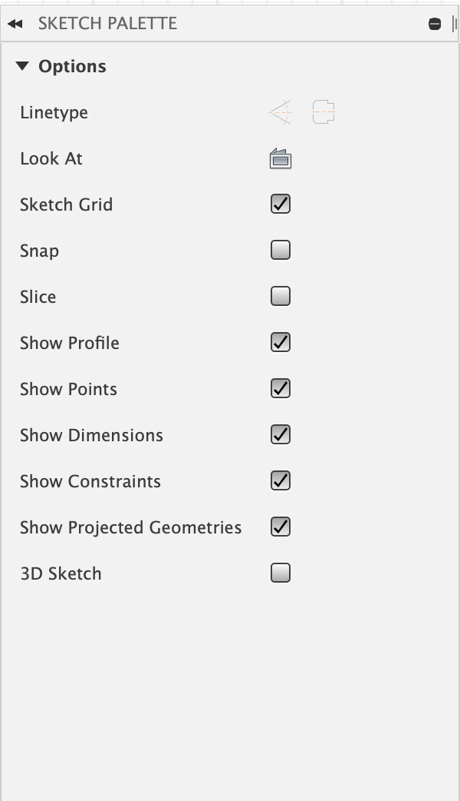

# Metamaterials

### Overview
We will use fusion to mockup the different kinds of mechanical behaviors we can realize using metamaterials. Metamaterials are often made up of individual cells or voxels each of which has it's own properties, e.g. rigid and sheering cells. Today we will learn how those cells can be modeled in a fusion sketch and how we can use sketch constraints to preview the motion a structure made of metamaterial cells will achieve. 

These mechanisms are not always intuitive to design. We've distributed pencils and paper to help you sketch out how the different kinds of cells can come together into one mechanism. **Feel free to work in small groups and submit together.** 

### Fusion Constraints
Today we will be using a lot of constraints within fusion. A constraint limits the degrees of freedom an element can have. For example, a line centered at the origin, with a length of 10mm is constrained, but can still be manipulated. 

https://user-images.githubusercontent.com/16449141/231341760-670dc7ce-33a5-461e-a212-27e24dc98c38.mov

This is because the element is not **fully** constrained. If in addition to the constraints above, we specified that the line must be at an angle of 120 degrees from the *x* axis, then the line would be fully constrained (an indication of this is the line going from being blue to black). 

There are many ways to constrain sketch elements in fusion, all of which can be found in the Constraints menu of the Sketch tab. Today, we will primarily be using two kinds of constraints to manipulate metamaterial cells: coincident and parallel.

##### Coincident
This constrains the position of two points (or a point and a line) to be the same. In the case of two points, it means their geometric coordinates must always be identical.

https://user-images.githubusercontent.com/16449141/231341856-2a634122-20b6-4321-ad54-04375347c5af.mov

##### Parallel
This constrains the orientation of two lines to be parallel to one another.

https://user-images.githubusercontent.com/16449141/231341896-51671729-621b-4f17-b388-ad69ec443006.mov

#### Constraining Edges
We will also often need to constrain two edges of a part to always be aligned to one another. Like most things in fusion, there are a few ways to do this, even with only the constraints shown above. Below is one way to achieve this, by first constraining two edges to be parallel to one another, and then by constraining one pair of the corners together. Crucially, this will only work if the cells are all the same dimension.

https://user-images.githubusercontent.com/16449141/231342544-2a408b14-7eb4-45a5-b0db-3575e46587b9.mp4

#### A Word of Warning
While fusion is a capable software, it does not have a perfect constraint solver. In some cases, an adjustment you make in your sketch may throw fusion off, and make your sketch contort in all sorts of ways. This is usually easy to fix with a quick undo, but it can become a bit frustrating over time. Please let us know if you're having issues, we are here to help. 

There will be a lot of constraints and dimensions on your sketch today. If these are distracting, it could be helpful to turn them off in the rendered by unchecking 'Show Constraints' and 'Show Dimensions' in the sketch palette. 

### Rigid and Sheer Cells
For today, we give you a set of pre-defined rigid and sheer cells. You can find them [here](https://a360.co/3ms87tr). These cells are all made using the constraints we described above. We won't ask you to design these from scratch, but it could be helpful to consider how we designed them in fusion. There are two primary kinds of cells we'll be working with today, **rigid** and **sheer** cells. 

#### Fixing (Anchoring) Points and Edges
To see how these different kinds of cells move in Fusion, we must first anchor some part of them. We do this by fixing a point or edge of the cell in place and then manipulating the cell relative to that point. 

Here are the rigid and sheer cells being fixed and manipulated. 

https://user-images.githubusercontent.com/16449141/231342573-ec93c82c-0503-4476-b47c-fe48112526b7.mov

https://user-images.githubusercontent.com/16449141/231342595-5072ba6d-78cd-4177-9f5b-1b87974924e4.mov

### Making a Door Latch
Using what we've learned so far, we'll reconstruct the door latch example shared in class using the cells we've provided you. Remember from lecture how this works.

There are two groups of rigid cells and two groups of sheer cells. While we could model each of these as groups of the same cell, we'll instead simplify a bit and model them each as their own cell. We'll start with two sheer cells, one 1x1 rigid cell and one 1x2 rigid cell.

All of these cells meet at the pivot point of the latch. To ensure they all share that point we will use the coincident constraint on a corner of each cell.

https://user-images.githubusercontent.com/16449141/231342620-c46f9860-61ce-4336-b0f7-015d78a8f6af.mov

Next, we must make sure that the corners of the sheer cell are connected to the corners of the rigid cell. We can again do this with the coincident constraint. Note the second pair of corners may be tricky due to the overlapping edges, if it's hard to click, please zoom in for more separation between the unconstrained points. 

https://user-images.githubusercontent.com/16449141/231342642-59c918fd-a6df-4b4d-9ad0-15a9f56ca3fc.mp4

Now that the cells are connected to one another, we can anchor a point and start applying a force to the cells. For now we'll anchor the point under the pivot and apply a force by pulling the corner of the lower rigid cell down.

https://user-images.githubusercontent.com/16449141/231342671-288bee67-8666-417c-8df1-1bd1ea79824f.mp4

The latch moves! But you may notice that it's not moving exactly as we'd want it to. The latch is staying rotated about the pivot. Recall from lecture that in addition to the cells translating the force, we need additional cells to pad or support the horizontal translation. 

While we could do this with additional cells, we'll instead use the horizontal constraint in fusion. This ensures that the element selected remains horizontal (or vertical) as it moves. 

https://user-images.githubusercontent.com/16449141/231342714-8b286eec-448a-473c-9104-d2e8dffc78cc.mp4

Now that the latch is moving as expected, we can move on to more metamaterial mechanisms using the same set of tools!

### Your Turn! Re-design Alex's Pliers
In lecture we saw these pliers that were printed entirely as one part. The core of what is happening here is quite simple, see if you can design the pliers using our cells in fusion.

#### What to hand-in!
1. Two screenshot of the pliers you designed in fusion at two positions (at extreme ends), showing where the part is constrained and what point you are moving. (4 pts)
2. An explanation of how the cells you used to make the pliers interact with one another. (4 pts)
3. Other than 3D printing with flexible filament, how might you fabricate this part? Out of what material? (2 pts)
